Sure — here’s the **final, clean Markdown version** (no code blocks around it), ready to paste directly into GitHub or Notion and share as-is:

---

# 🎧 CodeFM 
A GitHub → Podcast Automation Pipeline

## **Overview**

This project aims to build an **automated pipeline** that converts any GitHub repository into a **funny 3–5 minute podcast** that explains the codebase in an engaging and entertaining way.

The system uses [**Flatr**](https://github.com/dimastatz/flatr) to flatten a repository into a single Markdown file, **Gemini** (LLM) to generate a humorous and informative podcast script, and **Kokoro TTS** to transform that script into a natural, expressive audio narration.

The end result: a fully automated “**Code-to-Podcast**” system that turns open-source code into a story — informative for developers, fun for everyone.

---

## **Objectives**

1. **Make codebases fun and accessible** by turning them into humorous, story-driven podcasts.
2. **Automate** the process of extracting, summarizing, and narrating technical content.
3. **Generate audio content at scale** for any public GitHub repository.

---

## **System Architecture**

### **1. Input Layer**

* **User Input:** GitHub repository URL
* **Example:**

  ```
  https://github.com/dimastatz/flatr
  ```

### **2. Repository Processing (Flatr)**

* **Tool:** [Flatr](https://github.com/dimastatz/flatr)
* **Action:** Flatten the GitHub repository structure into a single, human-readable Markdown file (`README_FLAT.md`).
* **Purpose:** Consolidate code and documentation into a compact form that Gemini can easily understand.

### **3. Script Generation (Gemini)**

* **Input:** Flattened Markdown file
* **Model:** Google **Gemini**
* **Prompt Example:**

  ```
  You are a funny podcast scriptwriter. Read the following Markdown that represents a GitHub repository.
  Create a 3–5 minute entertaining podcast script that humorously explains what this codebase does,
  who might have written it, and what problems it solves — as if narrating to curious developers and tech lovers.
  ```
* **Output:** A short, witty, and educational podcast script (intro, middle, outro).

### **4. Audio Generation (Kokoro TTS)**

* **Input:** Podcast script text
* **Engine:** **Kokoro TTS** (Text-to-Speech)
* **Output:** High-quality MP3 or WAV file (~3–5 minutes long)
* **Features:**

  * Natural, expressive, humorous voice
  * Adjustable tone and pacing
  * Optional voice styles for variety

### **5. Optional Post-Processing**

* Add intro/outro music
* Include sound effects or transitions
* Package metadata and cover art for publishing

---

## **Technical Workflow**

```mermaid
flowchart LR
A[GitHub URL] --> B[Flatr - Flatten to Markdown]
B --> C[Gemini - Generate Funny Podcast Script]
C --> D[Kokoro TTS - Convert Script to Audio]
D --> E[Output: 3–5 Minute Podcast File]
```



---

## **Implementation Plan**

| Phase | Task                             | Tools              | Deliverable             |
| ----- | -------------------------------- | ------------------ | ----------------------- |
| **1** | Set up repo cloning & flattening | Flatr, GitHub API  | Flattened Markdown      |
| **2** | Integrate Gemini API             | Gemini API         | Humorous podcast script |
| **3** | Connect Kokoro TTS               | Kokoro API         | Audio narration (MP3)   |
| **4** | Automate pipeline                | Python / FastAPI   | End-to-end automation   |
| **5** | Deploy as web service            | Cloud Run / Vercel | Public web interface    |

---

## **Expected Outcomes**

* Fully automated “GitHub → Funny Podcast” pipeline
* 3–5 minute MP3 episodes that explain codebases in a lighthearted tone
* Scalable tool to bring humor and understanding to open-source projects

---

## **Example Use Case**

**Input:**

```
https://github.com/dimastatz/flatr
```

**Output:**
🎙️ *"Welcome to CodeCast! Today we’re flattening your repo — literally! Let’s see how Flatr squeezes an entire codebase into one tidy Markdown file, saving developers from endless folder spelunking..."*

---

## **Team & Roles**

* **AI Developer:** Build pipeline and integrate APIs
* **LLM Engineer:** Craft Gemini prompts and refine humor tone
* **Audio Engineer:** Tune Kokoro voices and add effects
* **Project Lead:** Oversee milestones and ensure project delivery

---

## **Timeline**

| Week | Milestone                                  |
| ---- | ------------------------------------------ |
| 1    | Flatr integration and GitHub handling      |
| 2    | Gemini prompt design and script generation |
| 3    | Kokoro TTS integration                     |
| 4    | Full pipeline automation                   |
| 5    | Demo and deployment                        |

---

## **Deliverables**

* Command-line tool or web app that:

  * Accepts a GitHub URL
  * Produces a **funny, 3–5 minute MP3 podcast** explaining the codebase

---

## **License**

MIT License (recommended for open collaboration)

---

## **Acknowledgements**

* [Flatr](https://github.com/dimastatz/flatr) for repository flattening
* [Gemini](https://ai.google/) for script generation
* [Kokoro TTS](https://kokoro.ai/) for expressive voice synthesis

---

Would you like me to append a **“How It Works” section** with a short example of Python API calls for Flatr, Gemini, and Kokoro (so others can reproduce it)?
